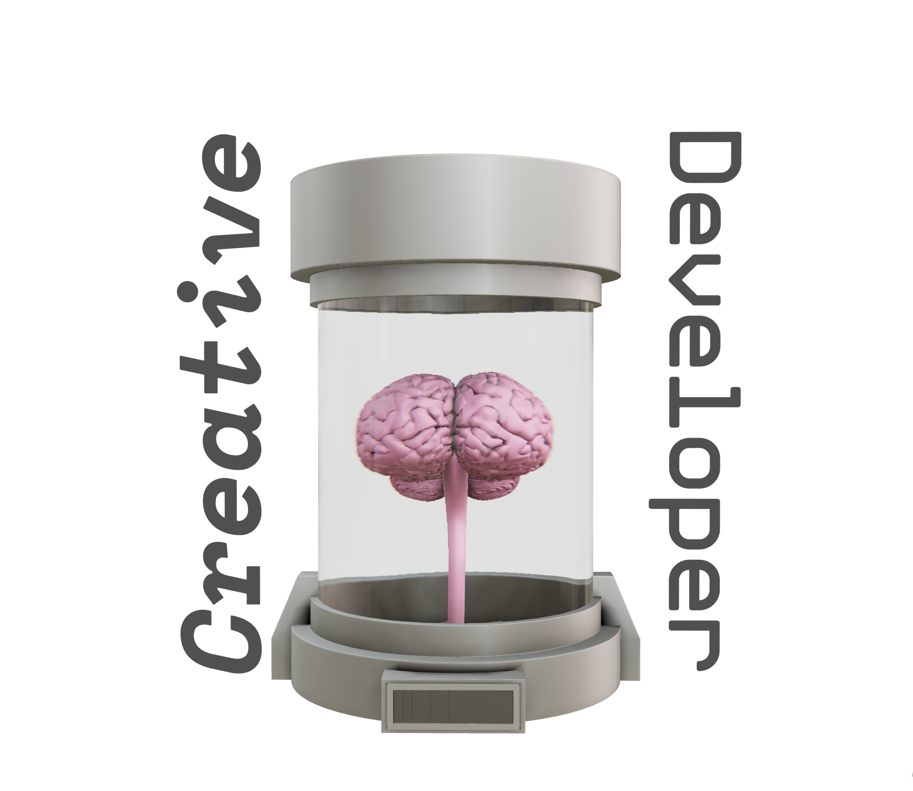

# Creative Developer (aka "Bryan's Brain")

This is the repo for a small sort of art piece I made about bringing together creativity and problem-solving into software development as a creative developer.

You can see it running live [here](https://creativedeveloper.vercel.app/).

Drag the page to rotate, and click the "auto-rotate" toggle to turn automatic rotation on/off.

## Tech stack:

- Typescript
- React
- Three.js
- React-Three-Fiber
- Drei
- Next.js
- Tailwind
- Reat-Spring
- Jotai
- Blender for 3D modelling

This project was bootstrapped with [`create-r3f-app`](https://github.com/utsuboco/create-r3f-app)
